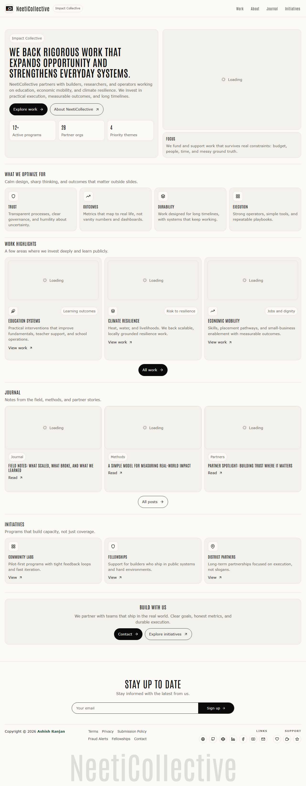

# NeetiCollective

NeetiCollective is an editorial-style React website for exploring impact work, initiatives, journal entries and practical community resources.



## Features

- Editorial home, work, journal and initiative pages
- Lazy-loaded routes with pathname-aware loading state
- Detail pages for work, journal and initiatives
- Fixed responsive header with local logo and mobile navigation
- Newsletter form with validation feedback
- Icon-only social and support links
- Floating go-to-top control and responsive layouts

## Tech stack

React, Vite, React Router, styled-components, MUI, React Icons, React Toastify and Axios.

## Run locally

```bash
npm install
npm run dev
```

## Deploy

```bash
npm run deploy
```

Live site: [NeetiCollective](https://a2rp.github.io/neeti-collective/)

## Links

- Portfolio: [https://www.ashishranjan.net/](https://www.ashishranjan.net/)
- GitHub: [https://github.com/a2rp](https://github.com/a2rp)
- CodePen: [https://codepen.io/ash1198](https://codepen.io/ash1198)
- LinkedIn: [https://www.linkedin.com/in/aashishranjan](https://www.linkedin.com/in/aashishranjan)
- Facebook: [https://www.facebook.com/theash.ashish/](https://www.facebook.com/theash.ashish/)
- YouTube: [https://www.youtube.com/@ashishranjan-ashz?sub_confirmation=1](https://www.youtube.com/@ashishranjan-ashz?sub_confirmation=1)
- Email: [mailto:ash.ranjan09@gmail.com](mailto:ash.ranjan09@gmail.com)

## Support

- Support: [https://a2rp-donation-page.netlify.app/](https://a2rp-donation-page.netlify.app/)
- Buy Me a Coffee: [https://buymeacoffee.com/a2rp](https://buymeacoffee.com/a2rp)
- Patreon: [https://patreon.com/a2rp](https://patreon.com/a2rp)