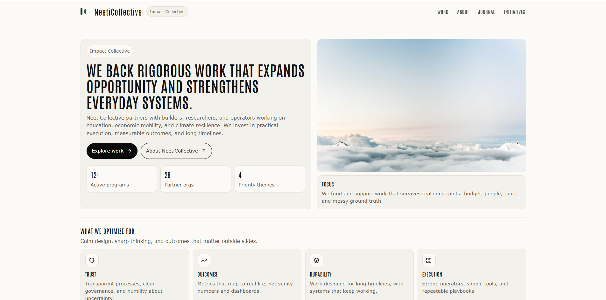

# NeetiCollective

NeetiCollective is a clean, editorial-style impact collective website built with React and Vite.  
The project focuses on clarity, restraint, and strong information hierarchy rather than visual noise.

This is a frontend-only implementation designed to be easily connected to a backend later without restructuring the UI.

---



---

## Tech Stack

- React 18
- Vite
- React Router DOM
- Styled Components
- MUI (loader only)
- React Icons
- React Toastify
- Axios (API ready)

---

## Features

- Editorial layout inspired by institutional foundations
- Modular page architecture
- Sub-routes for Work, Journal, and Initiatives
- Lazy-loaded routes with fallback loader
- Image loader component (no blank space while loading)
- Toast notifications ready for API integration
- GitHub Pages deployment ready
- Clean dependency structure

---

## Project Structure

```
src/
│
├── components/
│   ├── appHeader
│   ├── appFooter
│   └── scrollToTop
│
├── pages/
│   ├── home
│   ├── work
│   ├── workDetail
│   ├── journal
│   ├── journalDetail
│   ├── initiatives
│   ├── initiativeDetail
│   ├── about
│   ├── contact
│   ├── terms
│   ├── privacy
│   ├── submissionPolicy
│   ├── fraudAlerts
│   └── fellowships
│
├── App.jsx
├── AppRoutes.jsx
└── main.jsx
```

---

## Development

Install dependencies:

```
npm install
```

Start development server:

```
npm run dev
```

Preview production build:

```
npm run preview
```

---

## Production Build

```
npm run build
```

Output will be generated in the `dist` folder.

---

## GitHub Pages Deployment

The project is configured for GitHub Pages deployment.

Make sure in `vite.config.js`:

```
base: "/your-repo-name/",
```

And in `main.jsx`:

```
<BrowserRouter basename="/your-repo-name">
```

Deploy:

```
npm run deploy
```

This publishes the `dist` folder to the `gh-pages` branch.

---

## Notes

- All images use fixed-height wrappers with full object-fit coverage.
- A loader is shown while images load.
- Newsletter and forms are frontend-functional and API-ready.
- Replace mock API functions with real backend endpoints when available.

## Links

- Portfolio: [https://www.ashishranjan.net](https://www.ashishranjan.net)
- GitHub: [https://github.com/a2rp](https://github.com/a2rp)
- CodePen: [https://codepen.io/ash1198](https://codepen.io/ash1198)
- LinkedIn: [https://www.linkedin.com/in/aashishranjan](https://www.linkedin.com/in/aashishranjan)
- Facebook: [https://www.facebook.com/theash.ashish/](https://www.facebook.com/theash.ashish/)
- YouTube: [https://www.youtube.com/@ashishranjan-ashz?sub_confirmation=1](https://www.youtube.com/@ashishranjan-ashz?sub_confirmation=1)
- Email: [ash.ranjan09@gmail.com](mailto:ash.ranjan09@gmail.com)

## Support

- Support: [https://a2rp-donation-page.netlify.app/](https://a2rp-donation-page.netlify.app/)
- Buy Me A Coffee: [https://buymeacoffee.com/a2rp](https://buymeacoffee.com/a2rp)
- Patreon: [https://patreon.com/a2rp](https://patreon.com/a2rp)
<!-- Project links -->

## Links

- Live: [https://a2rp.github.io/neeti-collective/](https://a2rp.github.io/neeti-collective/)
- Repository: [https://github.com/a2rp/neeti-collective](https://github.com/a2rp/neeti-collective)
- Portfolio: [https://www.ashishranjan.net/](https://www.ashishranjan.net/)
- GitHub: [https://github.com/a2rp](https://github.com/a2rp)
- CodePen: [https://codepen.io/ash1198](https://codepen.io/ash1198)
- LinkedIn: [https://www.linkedin.com/in/aashishranjan](https://www.linkedin.com/in/aashishranjan)
- Facebook: [https://www.facebook.com/theash.ashish/](https://www.facebook.com/theash.ashish/)
- YouTube: [https://www.youtube.com/@ashishranjan-ashz?sub_confirmation=1](https://www.youtube.com/@ashishranjan-ashz?sub_confirmation=1)
- Email: [ash.ranjan09@gmail.com](mailto:ash.ranjan09@gmail.com)

## Support

- Support: [https://a2rp-donation-page.netlify.app/](https://a2rp-donation-page.netlify.app/)
- Buy Me a Coffee: [https://buymeacoffee.com/a2rp](https://buymeacoffee.com/a2rp)
- Patreon: [https://www.patreon.com/a2rp](https://www.patreon.com/a2rp)
